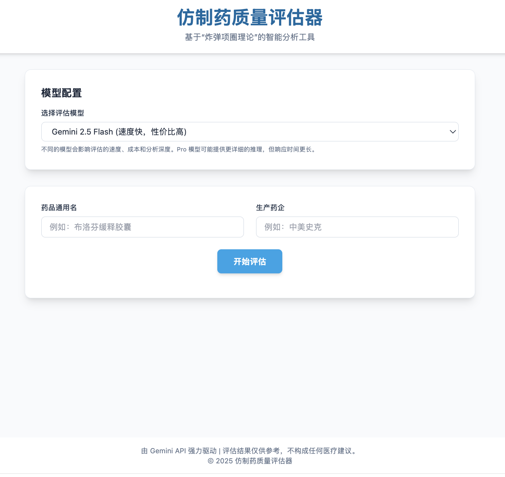

# 仿制药质量评估器

[](https://react.dev/) [](https://www.typescriptlang.org/) [](https://tailwindcss.com/) [](https://ai.google.dev/)

**一款基于“炸弹项圈理论”和 Google Gemini 模型的智能仿制药质量分析工具。**

本项目通过结合公开的经济数据、企业背景、地区监管历史以及相关的科学文献与监管意见，利用 Gemini 模型的强大分析能力和谷歌搜索的实时信息检索功能，为用户提供一个关于仿制药质量的参考评分和详细报告。

## 运行效果截图



## ✨ 核心特性

- **💥 基于“炸弹项圈理论”的独特分析视角**：从药企与地方经济的依存关系这一新颖角度评估其质量保障的内在动力。
- **🔬 融合科学证据**：不仅评估经济激励，还结合相关的科学文献、临床数据和监管机构（如 NMPA, FDA）的审查意见，提供更全面的质量画像。
- **🌐 实时信息检索**：集成 Google Search Grounding，确保分析数据来源的及时性和准确性。
- **📊 动态评分体系**：提供一个直观的综合分数，并辅以多个维度的详细评分和解释。
- **📝 透明的评估过程**：实时展示评估的每一步骤（搜索、分析、验证），并列出所有参考信息来源，让逻辑清晰可见。
- **🤖 可配置的 AI 模型**：支持在 Gemini 2.5 Flash、Gemini 2.5 Pro 及自定义模型之间灵活切换，以满足不同场景下的分析需求。
- **🎨 现代化用户界面**：采用 React 和 Tailwind CSS 构建，界面响应式、美观且易于使用。

---

## 💣 核心评估理念：理论与证据结合

本项目的核心分析逻辑是双轨并行的，结合了宏观的动机分析与微观的事实分析。

### 1. “炸弹项圈理论”

该理论认为：

> 如果一家制药企业是其所在地的经济命脉（例如，贡献了大量的税收和就业岗位），那么这家企业和当地政府实际上就共同戴上了一个无形的“炸弹项圈”。任何严重的产品质量问题都可能引爆这个项圈，导致企业声誉扫地、订单锐减，甚至倒闭，从而给当地经济带来灾难性的打击（如大规模失业、财政收入骤降）。
>
> 因此，这种深度的经济捆绑关系会形成一种强大的内在约束力，迫使企业和地方监管机构都以极高的标准来维护药品质量，以避免“引爆炸弹”。

本工具正是基于这一理论，通过评估药企的“项圈”有多紧，来推断其保障药品质量的 **内在动机** 有多强。

### 2. 科学文献与监管证据

药品质量的优劣终究需要科学证据来支撑。因此，本工具在进行理论推断的同时，还会：

- **检索学术文献**：查找关于该药品的生物等效性研究、临床试验数据、不良反应报告等。
- **审查监管信息**：查询主要监管机构（如中国的NMPA、美国的FDA）的审批记录、警告信、召回事件等关键信息。

通过将宏观的“动机”分析与微观的“证据”检验相结合，我们致力于提供一个更全面、更平衡的评估结果。

---

## 🚀 技术栈

- **前端框架**: [React](https://react.dev/)
- **语言**: [TypeScript](https://www.typescriptlang.org/)
- **UI 样式**: [Tailwind CSS](https://tailwindcss.com/)
- **AI & 模型**: [Google Gemini API (@google/genai)](https://ai.google.dev/)

---

## 🛠️ 本地部署与运行

请按照以下步骤在您的本地环境中运行本项目。

### 1. 先决条件

- [Node.js](https://nodejs.org/) (建议版本 >= 18.0.0)
- [npm](https://www.npmjs.com/) 或 [yarn](https://yarnpkg.com/)

### 2. 克隆项目

```bash
git clone https://github.com/your-username/generic-drug-evaluator.git
cd generic-drug-evaluator
```

### 3. 安装依赖

```bash
npm install
# 或者
yarn install
```

### 4. 配置环境变量

在项目根目录下创建一个名为 `.env` 的文件，并添加您的 Google Gemini API 密钥。

```
# .env

API_KEY="在此处填入您的Google Gemini API密钥"
```
> **重要提示**: `services/geminiService.ts` 文件中通过 `process.env.API_KEY` 读取此密钥。请确保您已在 [Google AI Studio](https://aistudio.google.com/app/apikey) 获取了有效的 API Key。

### 5. 启动项目

```bash
npm run dev
# 或者
yarn dev
```

项目将在本地启动一个开发服务器，您可以根据终端提示访问对应的 URL。

---

## 📂 项目结构

```
/
├── public/
│   └── ... (静态资源)
├── src/
│   ├── components/       # 可复用的React组件
│   │   ├── Header.tsx
│   │   ├── InputForm.tsx
│   │   ├── ResultsDisplay.tsx
│   │   └── ...
│   ├── services/         # API调用相关服务
│   │   └── geminiService.ts
│   ├── types/            # TypeScript类型定义
│   │   └── index.ts
│   ├── App.tsx           # 主应用组件
│   └── index.tsx         # React应用入口
├── index.html
├── metadata.json
├── package.json
└── README.md
```

---

## 📄 免责声明

本工具提供的所有评估结果和数据均基于公开信息和 AI 模型分析生成，**仅供学术研究和参考之用**，不构成任何形式的医疗建议、投资建议或法律意见。在做出任何与健康相关的决策前，请务必咨询专业的医生或药师。

---

## 📜 开源许可

本项目采用 MIT License 开源。
